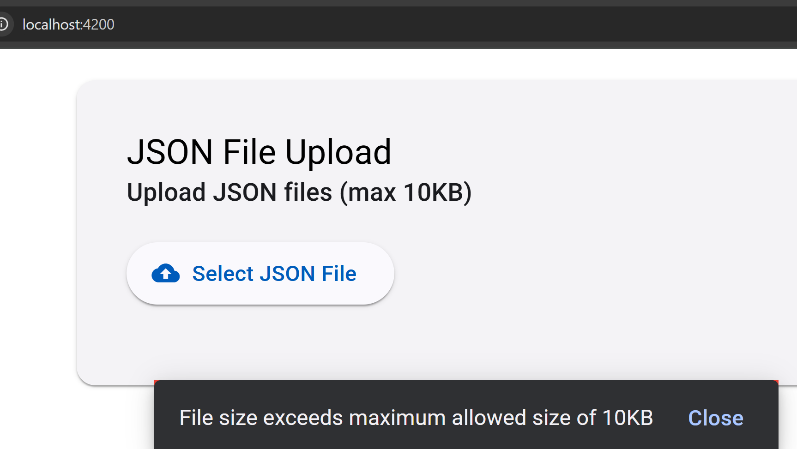

```typescript
    // Check file size
    if (file.size > this.MAX_FILE_SIZE) {
      this.showError(`File size exceeds maximum allowed size of ${this.MAX_FILE_SIZE / 1024}KB`);
      this.resetFileInput(fileInput);
      return;
    }
```

